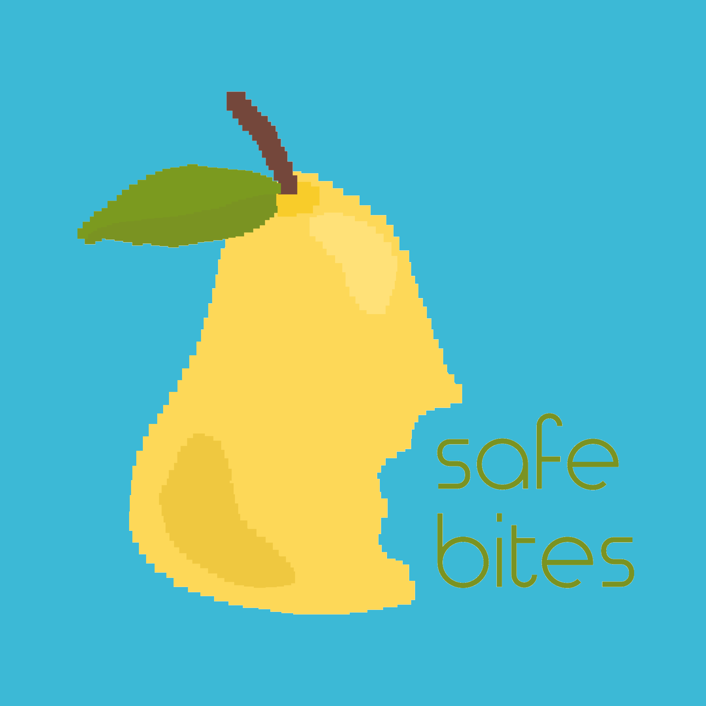
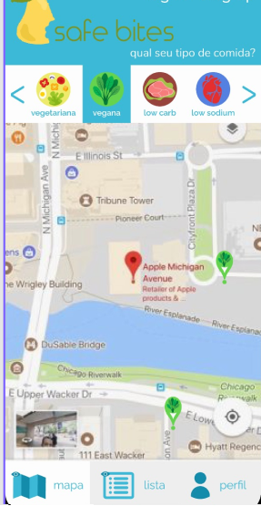
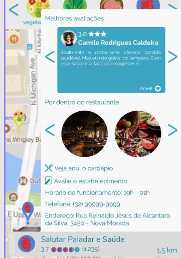
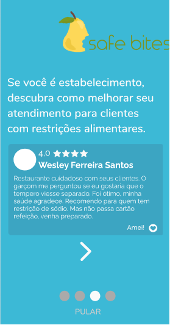
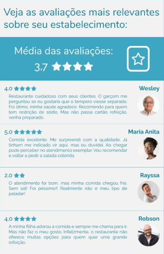

 <p align="center">
   
  <p align="center">Qual seu tipo de comida?</p>
 </p>

## Índice

- [Sobre](#sobre)
- [Ideia do Projeto](#ideia-do-projeto)
- [Screenshots](#screenshots)
- [Techs](#techs)
  - [Prototipagem](#prototipagem)
  - [Front end](#front-end)
  - [Back end](#back-end)
- [Como rodar](#como-rodar)
- [Como contribuir](#como-contribuir)
- [Contato](#contato)

## Sobre

Projeto integrador desenvolvido durante o curso de Desenvolvimento Web Full Stack Java oferecido pela [digitalhouse](https://www.digitalhouse.com/br/) em parceria com a universidade Santander.
<br>

## Ideia do Projeto

A ideia do projeto surgiu a partir da problemática levantada pelo membro da equipe [Matheus Matsukawa](https://github.com/matheus-matsukawa/) para encontrar restaurantes em sua cidade, no interior, que atendessem bem suas restrições alimentares (vegeteriano). Após algumas conversas em grupo, acabamos decidindo desenvolver uma aplicação que poderia vir a facilitar a aproximação entre clientes com restrições alimentares e restaurantes que atendam as mesmas, com o objetivo final de construir uma espécie de rede social para amantes de comida com necessidades mais específicas. O protótipo inicial mobile para o projeto pode ser visualizado [clicando aqui](https://www.figma.com/file/GyB1k1kgx0pzk4KW9RQECQ/DH-Restaurante?node-id=129%3A1269).

## Screenshots

<p align="center">
   
   
   
   
<p>

## Techs

As seguintes ferramentas foram / serão utilizadas durante o desenvolvimento do projeto:

### Prototipagem

- **[Figma](https://www.figma.com/)**
- **[Adobe Illustrator](https://www.adobe.com/br/products/illustrator.html)**

### Front end

- **[HTML](https://developer.mozilla.org/pt-BR/docs/Web/HTML)**
- **[CSS](https://developer.mozilla.org/pt-BR/docs/Web/CSS)**
- **[JS](https://developer.mozilla.org/pt-BR/docs/Web/JavaScript)**
- **[jQuery](https://jquery.com/)**
- **[Bootstrap](https://getbootstrap.com/)**

### Back end

- **[Java](https://www.java.com/pt_BR/)**
- **[MySQL](https://www.mysql.com/)**
- **[Spring Boot](https://spring.io/projects/spring-boot)**

# Como rodar

```
## Clonar o repositório
git clone https://github.com/pi-categorizar-restaurantes/safe-bites

## Acessar o diretório novo criado
cd safe-bites

## Abrir o espaço de trabalho em sua IDE preferida. (EX: VSCode)
code .

## Executar o servidor (EX: Live Server)

```

## Como contribuir ? <br/>

```
- Faça um fork desse repositório;
- Cria uma branch com a sua feature: `git checkout -b minha-feature`;
- Faça commit das suas alterações: `git commit -m 'feat: Minha nova feature'`;
- Faça push para a sua branch: `git push origin minha-feature`.

Depois que o merge da sua pull request ser feito, você pode deletar a sua branch.
```

## Contato

<p>Carlos Castro - [carloscastrodev](http://github.com/carloscastrodev/) - contato-carloscastro@hotmail.com</p>
 
<p> Macedo - [estevits](https://github.com/estevits/) - macedoestevaof@gmail.com</p>
 
<p>Geraldo Varriale - [gsvarriale](https://github.com/gsvarriale/) - geraldovarriale@gmail.com</p>
 
<p>Matheus Matsukawa - [matheus-matsukawa](https://github.com/matheus-matsukawa/) - matheusmatsu@gmail.com</p>
